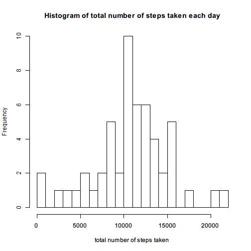
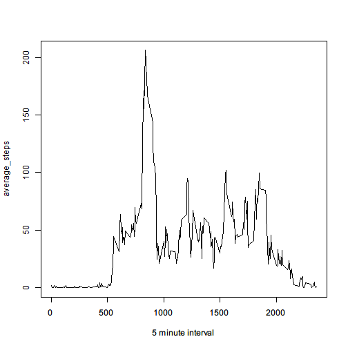
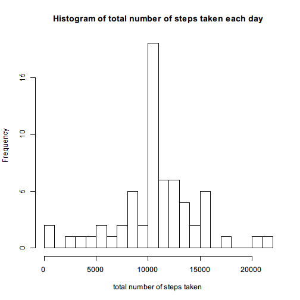
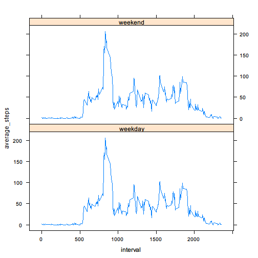

# Reproducible Research: Peer Assessment 1


## Loading and preprocessing the data

```r
dat = read.csv("activity.csv")
dat = transform(dat, date = as.Date(date))  #transform the 'date' column to the R class 'Date'
```


## What is mean total number of steps taken per day?

```r
# aggregate is a handy function, like in SQL one can use 'sum(xxx) GROUP BY
# yyy'
daysum = aggregate(dat$steps, by = list(dat$date), sum)
names(daysum) = c("day", "steps")
hist(daysum[, 2], 20, xlab = "total number of steps taken", main = "Histogram of total number of steps taken each day")
```

 

### The mean and median total number of steps taken per day

```r
print(paste("mean:", mean(daysum$steps, na.rm = TRUE)))
```

```
## [1] "mean: 10766.1886792453"
```

```r
print(paste("median:", median(daysum$steps, na.rm = TRUE)))
```

```
## [1] "median: 10765"
```


## What is the average daily activity pattern?

```r
avgstep = aggregate(dat$steps, by = list(dat$interval), mean, na.rm = TRUE)
names(avgstep) = c("5 minute interval", "average_steps")
plot(avgstep, type = "l")
```

 

### Which 5-minute interval, on average across all the days in the dataset, contains the maximum number of steps?

```r
avgstep[which.max(avgstep[, 2]), 1]
```

```
## [1] 835
```


## Imputing missing values
- the total number of missing values in the dataset:

```r
sum(is.na(dat$steps))
```

```
## [1] 2304
```

-  Fill in missing values using the mean for the interval

```r
# merge is also a handy function, just like SQL join
dat2 = merge(dat, avgstep, by.x = "interval", by.y = names(avgstep)[1])
dat2$steps[is.na(dat2$steps)] <- dat2$average_steps[is.na(dat2$steps)]
```

The dataset after filling in the missing values:

```r
head(dat2)
```

```
##   interval steps       date average_steps
## 1        0 1.717 2012-10-01         1.717
## 2        0 0.000 2012-11-23         1.717
## 3        0 0.000 2012-10-28         1.717
## 4        0 0.000 2012-11-06         1.717
## 5        0 0.000 2012-11-24         1.717
## 6        0 0.000 2012-11-15         1.717
```

### Histogram and mean and median after filling the missing values:

```r
daysum = aggregate(dat2$steps, by = list(dat2$date), sum)
names(daysum) = c("day", "steps")
hist(daysum[, 2], 20, xlab = "total number of steps taken", main = "Histogram of total number of steps taken each day")
```

 

```r
print(paste("mean:", mean(daysum$steps, na.rm = TRUE)))
```

```
## [1] "mean: 10766.1886792453"
```

```r
print(paste("median:", median(daysum$steps, na.rm = TRUE)))
```

```
## [1] "median: 10766.1886792453"
```


The mean is equal to the origin one

The median becomes the same as mean

The histogram's shape is nearly unchanged.

## Are there differences in activity patterns between weekdays and weekends?


```r
Sys.setlocale("LC_TIME", "English")
```

```
## [1] "English_United States.1252"
```

```r

# creating a factor variable
dat2$weekdays = factor(format(dat2$date, "%A"))
levels(dat2$weekdays)
```

```
## [1] "Friday"    "Monday"    "Saturday"  "Sunday"    "Thursday"  "Tuesday"  
## [7] "Wednesday"
```

```r

# replace the levels
levels(dat2$weekdays) <- list(weekday = c("Monday", "Tuesday", "Wednesday", 
    "Thursday", "Friday"), weekend = c("Saturday", "Sunday"))
levels(dat2$weekdays)
```

```
## [1] "weekday" "weekend"
```


### Making plots
Make a panel plot containing a time series plot (i.e. type = “l”) of the 5-minute interval (x-axis) and the average number of steps taken, averaged across all weekday days or weekend days (y-axis).

```r
library(lattice)
# Note: according to the way that I generated the column
# 'average_steps'(using 'merge' function), it is exactly what I want to plot
xyplot(average_steps ~ interval | weekdays, data = dat2, layout = c(1, 2), type = "l")
```

 

